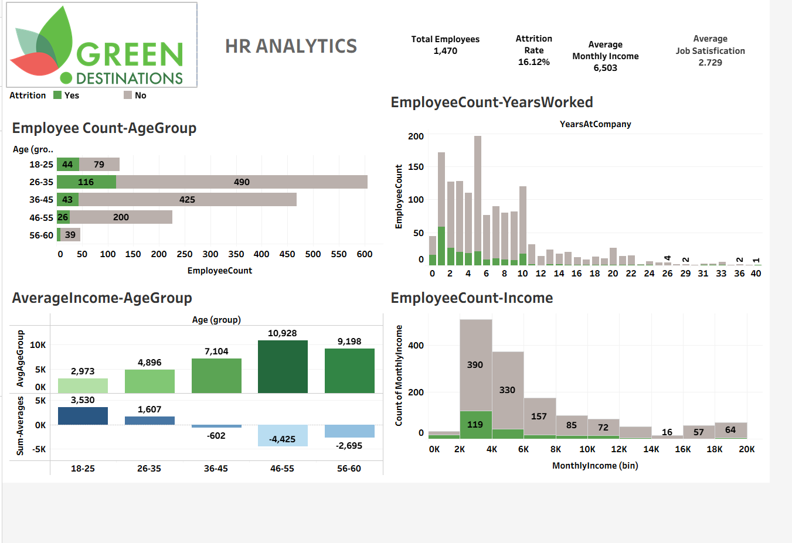

# 🌱 Green Destinations – HR Analytics Dashboard (Tableau)

## 📌 Project Overview
This project is part of Green Destinations (HR Analytics) from a Tableau data analytics course.  
The goal of this project is to analyze **employee attrition and workforce trends** using Tableau and present insights through an interactive dashboard.

The project covers the **full Tableau workflow**: data connection, preparation, chart creation, dashboard design, and publishing.

---

## 🎯 Business Objective
Green Destinations is facing **employee attrition challenges**.  
This dashboard helps HR teams understand:
- Why employees leave
- Which groups are most affected
- Key patterns driving attrition

---

## 🧠 Key Questions Answered
- What is the overall employee attrition rate?
- Which departments have the highest attrition?
- Does attrition vary by age, gender, or tenure?
- How does job satisfaction relate to attrition?
- What employee segments are at highest risk?

---

## 🛠 Tools & Technologies
- **Tableau Desktop**
- **CSV / Excel HR dataset**
- **Calculated Fields**
- **Filters & Dashboard Actions**
- **Tableau Public (for publishing)**

---

### 1️⃣ Project Brief
- Understand HR problem statement
- Identify key KPIs for attrition analysis

### 2️⃣ Data Connection & Preparation
- Connect HR dataset to Tableau
- Validate data types
- Clean and prepare fields

### 3️⃣ Chart Building (Part 1 & 2)
- Attrition by department
- Attrition by gender and age
- Tenure and satisfaction analysis

### 4️⃣ Headline Cards
- Total Employees
- Attrition Count
- Attrition Rate (%)

### 5️⃣ Dashboard Creation
- Combine charts into one interactive dashboard
- Apply filters for deeper analysis
- Maintain clean, HR-friendly design

### 6️⃣ Publishing
- Publish dashboard to **Tableau Public**
- Shareable and interactive online view

---

## 📊 Dashboard Features
- Interactive filters (Department, Gender, Age Group)
- KPI headline cards
- Clear visual storytelling
- Optimized layout for HR decision-making

---

### 📊 Final HR Analytics Dashboard

---

## ▶️ How to Run This Project
1. Download or clone this repository
2. Open **Tableau Desktop**
3. Open `green-destinations.twb`
4. Update dataset path if prompted
5. Explore worksheets and dashboard
6. (Optional) Publish to Tableau Public

---

## 🎓 Learning Outcomes
- Hands-on HR analytics experience
- Strong understanding of Tableau dashboards
- Real-world business storytelling
- End-to-end Tableau project for portfolio

